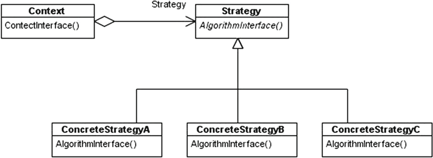

I implemented the strategy pattern on python. Strategy pattern is different implementations of the same algorithm. This means that the result should be exactly the same, but each implementation has a different performance and code complexity.
